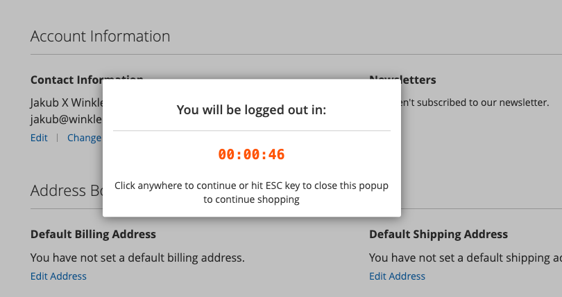

### Magento 2 Customer Session Timeout Popup

---

This module displays a popup to the customer indicating the number of seconds remaining until they are automatically logged out of the system. The following are its features:
* The module can be turned on or off through the Admin Panel.
* The duration of the customer's session is determined by the cookie lifetime settings configured in the Admin Panel.
* An Admin User has the ability to set the specific number of seconds remaining before a user is logged out, at which point the popup will be triggered.

### ChangeLog

---
V 1.0.0:
* initial release

### Known issue(s):

---
* prolonging customer session works for the PHP but the customer sections are not refreshed, native Magento JS clears them.